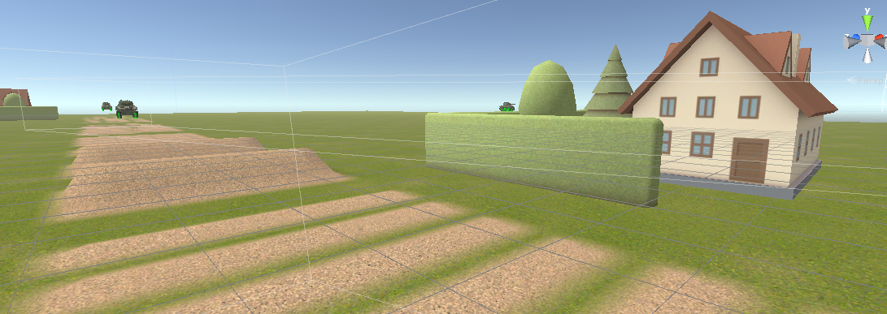
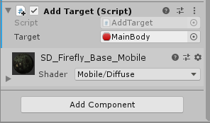
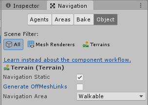
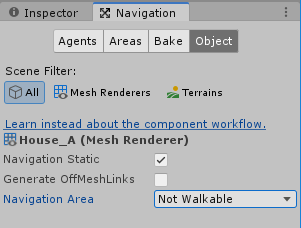
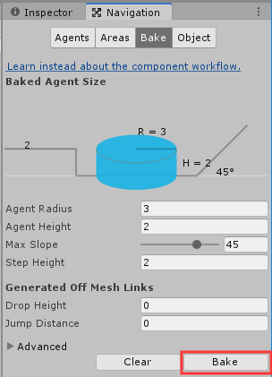
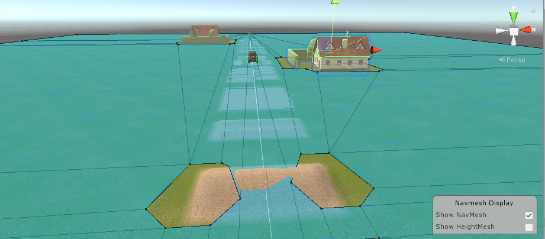

## 坦克对战游戏 AI 设计

**从商店下载游戏：“Kawaii” Tank 或 其他坦克模型，构建 AI 对战坦克。具体要求**

- **使用“感知-思考-行为”模型，建模 AI 坦克**

  **感知**是 agent 接收世界信息的行为，其获取的数据将是思考的输入。在游戏中，程序是可以获得游戏世界任意信息的，设计一个“干死”玩家的算法通常是比较容易的，因此如何限制信息获取是设计不同级别 agent 的核心问题。

  鉴于这是一个坦克对战游戏，因此有雷达存在，视觉听觉和嗅觉都不满足要求。只要玩家在地图上出现，就会被AI坦克的雷达扫描到。

  **思考** 就是算法，它的输入是感知的数据，输出是行为（behaviours）。 思考的算法，通常就是我们所说的游戏规则的一部分，即 agent 能做什么，该做什么。 

  当AI坦克扫描到玩家时，需要判断是否有遮挡，有遮挡则会绕行，否则直接开火。

  **行动**将思考（Think）的结果作为输入，该部分的任务就是使得 agent 行为更符合物理世界的规律，使得“心想事成”这样理想的结果变得不确定。

  如果思考得到的结果是绕行，那么做出改变方向的行动；如果思考结果是开火，则发射子弹。子弹是刚体，受重力影响。

- **场景中要放置一些障碍阻挡对手视线**

  放置一些房子来阻挡视线

  

- **坦克需要放置一个矩阵包围盒触发器，以保证 AI 坦克能使用射线探测对手方位**

  kawaii tank自带的场景中已经设置好触发器

- **AI 坦克必须在有目标条件下使用导航，并能绕过障碍。（失去目标时策略自己思考）**

  通过NavMesh实现这个功能

- **实现人机对战**

  - 打开Kawaii_Tank中的Test_Field场景。

  - 多添加几个房子作为遮挡，另外为了增加难度可以多放置几个AI坦克

  - 为AI坦克添加组件Nav Mesh Agent

  - 为每个AI坦克的mainbody挂载以下代码,并在Inspector界面设置AI坦克的target为玩家坦克的mainbody

    ```c#
    using System.Collections;
    using System.Collections.Generic;
    using UnityEngine;
    using UnityEngine.AI;
    
    public class AddTarget : MonoBehaviour
    {
        public GameObject target;
        NavMeshAgent mr;
    
        void Start()
        {
            mr = GetComponent<NavMeshAgent>();
        }
    
        // Update is called once per frame
        void Update()
        {
            mr.SetDestination(target.transform.position);
        }
    }
    ```

    

  - 修改Fire_Control_CS.cs的代码，令AI坦克也可开枪

    ```c#
    void Update ()
    		{
    			if (idScript.isPlayer) {
    				#if UNITY_ANDROID || UNITY_IPHONE
    				Mobile_Input ();
    				#else
    				Desktop_Input ();
    				#endif
    			}
                else{
                    // 游戏加载出来的三秒后AI坦克第一轮开火
                    if (isReady && Time.realtimeSinceStartup>startTime+3.0f) {
                        Fire ();
                    }
                }
    		}
    ```

  - 修改Damage_Control_CS.cs中的代码，使得AI坦克被打败后消失。在Start_Destroying中加入以下代码：

    ``` C#
    if(idScript.isPlayer == false) {
    	this.gameObject.SetActive(false);
    }
    ```

  - 修改Wheel_Control_CS.cs中的Desktop_Input函数，提高玩家坦克的速度

    ```c#
    if (Input.GetKeyDown (KeyCode.UpArrow) || Input.GetKeyDown (KeyCode.W)) {
        speedStep += 3.0f; // 0.5f -> 3.0f
        speedStep = Mathf.Clamp (speedStep, -1.0f, 1.0f);
    } else if (Input.GetKeyDown (KeyCode.DownArrow) || Input.GetKeyDown (KeyCode.S)) {
        speedStep -= 3.0f; // 0.5f -> 3.0f
        speedStep = Mathf.Clamp (speedStep, -1.0f, 1.0f);
    } else if (Input.GetKeyDown (KeyCode.X)) {
        speedStep = 0.0f;
    }
    ```

  - 打开window -> AI -> Navigation

  - 将场景中的Terrain设置为

    

  - 将场景中的所有房子设置为：

    

  - 点击bake按钮，生成Navmesh

    

    

